# Hi, I'm Maryam Kiani 👩‍💻 

💻 Building software, web applications & AI-driven solutions  
🤖 Exploring intelligent systems, automation & FinTech  
Persian , based in New Zealand 🇳🇿
A little GitHub profile refresh, more to come. ✨

---

## 🎓 Background  
I hold a **Master’s degree in Software Engineering** specialising in **Deep Learning**.  
My research focused on developing a **deep learning engine for financial market analysis** — using LSTM, GRU, and CNN models for **Forex and Stock Market prediction**.  

---

- ## 👩‍💻 About Me

I’m passionate about building **software and web applications and AI-driven solutions** that solve real-world problems.

- 🔧 Developing efficient, secure, and scalable web applications
- 🤖 Applying machine learning and deep learning to practical use cases
- ⚙️ Exploring automation, intelligent systems, and AI-powered applications
- 💳 Interested in financial technology (**FinTech**) and data-driven solutions
- 🤝 Open to collaboration on **Software and Web Development**, **AI**, **Integrations & Automation**, **FinTech**, and **Business Development**

---

## 🔗 Connect With Me

- 🌐 **TensorPage:** https://tensorpage.com
- 💼 **LinkedIn:** https://www.linkedin.com/in/mary-kiani

---

## 🛠️ Tech Stack

**Web Development**
- Python (Django, Flask)
- JavaScript (React, Node.js)
- PHP
- HTML & CSS
- Tailwind CSS & Bootstrap
- REST & GraphQL APIs
- SQL & PostgreSQL
- Authentication & Web Security
- WordPress & Bricks Builder
- Theme & Plugin Development

**Machine Learning / Deep Learning**
- TensorFlow & Keras
- PyTorch
- Scikit-learn
- Pandas & NumPy
- LSTM, GRU & CNN
- GANs
- Financial Market Prediction

**AI & Intelligent Systems**
- AI Agents
- AI-driven Applications
- Automation & Integrations

**DevOps & Development Tools**
- Docker
- Git & GitHub
- CI/CD Workflows
- Deployment

---

## 📊 GitHub Insights

---

## 🌱 Beyond Code
- 📖 Exploring the intersection of **AI & software development**
- 🎶 Music is my coding companion
- 🏊‍♀️ Swimming & snorkeling keep me connected to the real world 🌊
- ☕ Creating my own signature affogato
